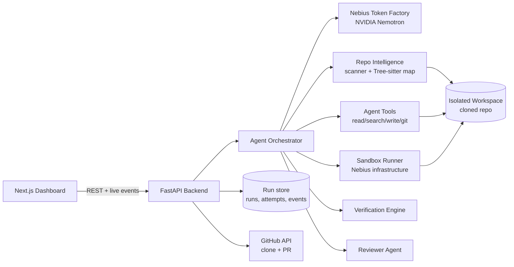
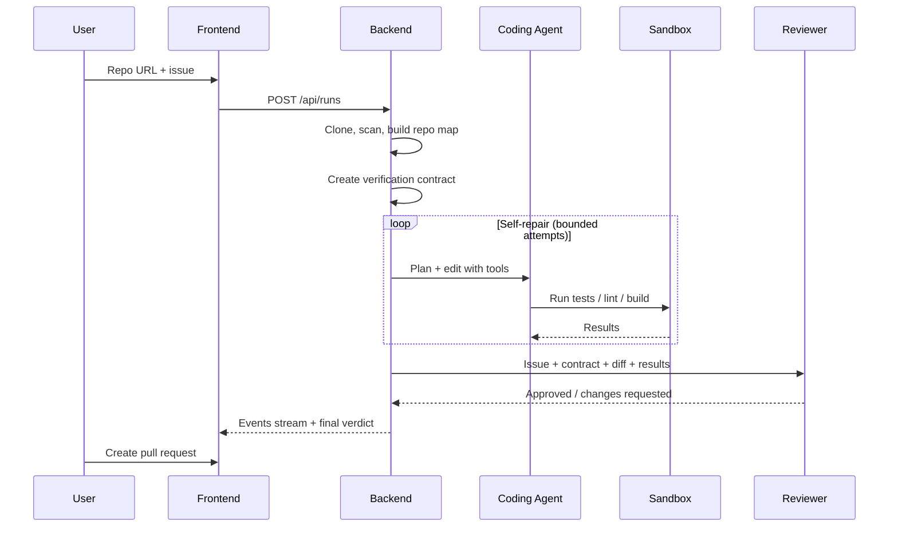

# PatchPilot Architecture

PatchPilot is an autonomous coding agent. It takes a GitHub issue, investigates the
repository, patches the code, runs it in a sandbox, repairs its own failures, and reports
success only when a verification contract and an independent reviewer agent both approve.

The phase-by-phase build plan lives in [`phases.md`](phases.md).

## System diagram



## Request lifecycle

1. User connects a repository and describes an issue in the dashboard.
2. Backend clones the repo into an isolated workspace and builds a repo map.
3. Orchestrator derives a **Verification Contract** from the issue.
4. Coding agent plans, selects files, and edits code through tools.
5. Sandbox runs install / test / lint / build; failures feed the **self-repair loop**.
6. Verification engine checks the contract; the **reviewer agent** challenges the patch.
7. On approval, the user views the diff and opens a pull request.
8. Every step is emitted as an event and streamed to the dashboard timeline.



## Components

| Component | Location | Responsibility |
| --------- | -------- | -------------- |
| Dashboard | `frontend/app/` | Repo explorer, agent timeline, terminal logs, verification panel |
| API client | `frontend/lib/api.ts` | Typed calls to the backend |
| API routes | `backend/app/api/` | Thin handlers: validate, delegate, shape the response |
| Config | `backend/app/config.py` | Single settings object loaded from the root `.env` |
| LLM client | `backend/app/llm/` | Nebius Token Factory calls, model routing, retries, error mapping |
| Repo intelligence | `backend/app/repo/` | Clone, scan, stack detection, repo map, retrieval |
| Agent | `backend/app/agent/` | Orchestrator loop, tools, prompts |
| Sandbox | `backend/app/sandbox/` | Allow-listed command execution with resource limits |
| Verification | `backend/app/verify/` | Contract generation and checking |
| Reviewer | `backend/app/review/` | Independent patch review |
| Run store | `backend/app/store/` | Runs, attempts, events |

## Model routing

| Role | Used for | Setting |
| ---- | -------- | ------- |
| `planner` | Planning, verification contract, review | `MODEL_PLANNER` (Nemotron Ultra) |
| `worker` | Edits, summaries, simple prompts | `MODEL_WORKER` (smaller Nemotron) |

## Error handling

- Provider failures raise a typed `LLMError` inside the backend.
- Handlers map them to `503` (provider not configured) or `502` (provider request failed)
  with a generic message. Raw provider responses, stack traces, and keys never reach the client.
- Retryable statuses (`429`, `5xx`) and transport errors are retried with exponential backoff.

## Security boundaries

- Secrets come only from the root `.env`; `.env.example` holds placeholders.
- Agent file tools are confined to the run's workspace (path-traversal guard).
- The sandbox runs allow-listed commands only, with CPU, memory, time, and network limits.
- The reviewer agent receives the issue, contract, diff, and results — not the coder's reasoning.

## Repository layout

```
PatchPilot/
├── frontend/          # Next.js (TypeScript, App Router, Tailwind)
├── backend/           # FastAPI (Python)
│   ├── app/
│   │   ├── main.py
│   │   ├── config.py
│   │   ├── api/
│   │   └── llm/
│   └── tests/
├── architecture.md
├── phases.md
├── .env.example
└── README.md
```
