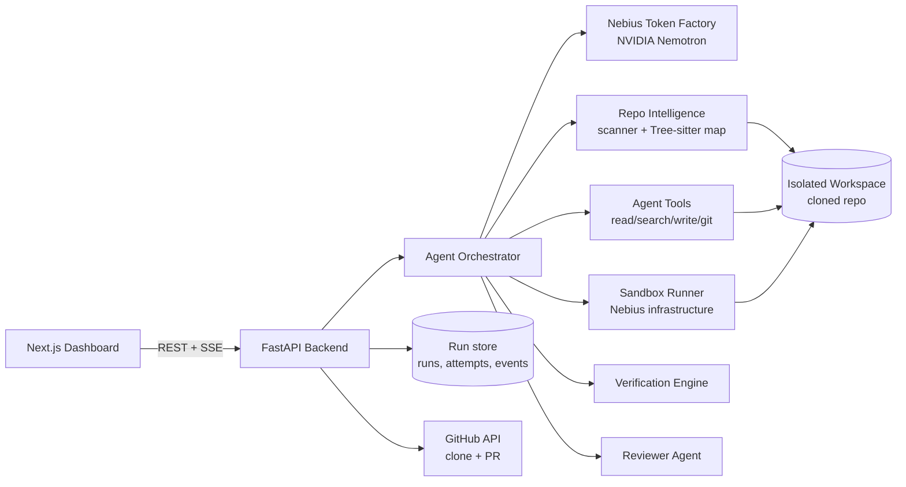

# PatchPilot — Build Phases

Coding & Agentic Engineering Track. An autonomous coding agent that takes a GitHub issue,
investigates the repository, patches the code, runs it in a sandbox, repairs its own
failures, and only reports success once a verification contract and an independent
reviewer agent both approve.

**Development path:**
Foundation → Repository Intelligence → Agent → Execution → Self-Repair → Verification → Product/Demo

---

## Table of contents

- [Architecture overview](#architecture-overview)
- [Open decisions](#open-decisions)
- [Build priority & cut-lines](#build-priority--cut-lines)
- [Phase 1 — Core Setup & Nebius/NVIDIA Integration](#phase-1--core-setup--nebiusnvidia-integration)
- [Phase 2 — GitHub Repository Understanding](#phase-2--github-repository-understanding)
- [Phase 3 — Autonomous Coding Agent](#phase-3--autonomous-coding-agent)
- [Phase 4 — Sandbox Execution + Self-Repair](#phase-4--sandbox-execution--self-repair)
- [Phase 5 — Verification & Reviewer Agent](#phase-5--verification--reviewer-agent)
- [Phase 6 — Product UI, Demo & Submission](#phase-6--product-ui-demo--submission)
- [Demo script](#demo-script)
- [Submission checklist](#submission-checklist)

---

## Architecture overview



**Request lifecycle**

1. User connects a repository and describes an issue in the dashboard.
2. Backend clones the repo into an isolated workspace and builds a repo map.
3. Orchestrator derives a Verification Contract from the issue.
4. Coding agent plans, selects files, and edits code through tools.
5. Sandbox runs install / test / lint / build; failures feed the self-repair loop.
6. Verification engine checks the contract; reviewer agent challenges the patch.
7. On approval, the user views the diff and opens a pull request.
8. Every step is emitted as an event and streamed to the dashboard timeline.

**Proposed layout**

```
PatchPilot/
├── frontend/                 # Next.js app (dashboard)
│   ├── app/
│   ├── components/
│   └── lib/api.ts            # typed API client
├── backend/                  # FastAPI app
│   ├── app/
│   │   ├── main.py
│   │   ├── config.py         # env/settings (single source of config)
│   │   ├── api/              # route modules
│   │   ├── llm/              # Nebius client, model routing
│   │   ├── repo/             # clone, scan, repo map, retrieval
│   │   ├── agent/            # orchestrator, tools, prompts
│   │   ├── sandbox/          # command runner
│   │   ├── verify/           # contract + verification engine
│   │   ├── review/           # reviewer agent
│   │   └── store/            # persistence for runs/attempts/events
│   └── tests/
├── demo-repo/                # controlled demo repository with a seeded bug
├── docs/architecture.md
├── .env.example
└── README.md
```

---

## Open decisions

Resolve these before (or during) the phase that needs them.

| # | Decision | Options | Needed by |
| - | -------- | ------- | --------- |
| D1 | Model routing | Nemotron Ultra (planning/review) + Super/Nano (simple edits, summaries) — confirm exact model IDs available on Token Factory | Phase 1 |
| D2 | Frontend package manager | pnpm / npm | Phase 1 |
| D3 | Backend package manager | uv / pip + requirements.txt | Phase 1 |
| D4 | Run storage | SQLite / Postgres / in-memory for MVP | Phase 3 |
| D5 | GitHub access | Public URL + PAT (MVP) / full GitHub OAuth App | Phase 2 |
| D6 | Sandbox runtime | Docker containers on a Nebius VM / other Nebius compute | Phase 4 |
| D7 | Live updates transport | Server-Sent Events / WebSockets / polling | Phase 3 |
| D8 | Demo bug | Stripe duplicate webhook (primary) / auth failure / concurrency issue | Phase 6 |
| D9 | Hosting | Frontend host + backend host (Nebius VM for backend + sandbox) | Phase 6 |

---

## Build priority & cut-lines

| Priority | Phase | Status if time runs out |
| -------- | ----- | ----------------------- |
| Mandatory | 1 → 2 → 3 → 4 | Must ship; this is the working MVP |
| High | 5 | The main differentiator — protect this time |
| Polish | 6 | Focus on clarity and demo, not new backend complexity |

**Fallback rules**

- If Tree-sitter integration stalls → fall back to regex/ripgrep-based symbol extraction.
- If OAuth stalls → repository URL + personal access token.
- If remote sandbox stalls → local Docker runner behind the same interface.
- If PR creation stalls → show the diff and offer a downloadable `.patch`.

---

## Phase 1 — Core Setup & Nebius/NVIDIA Integration

**Goal:** prove the required hackathon technology works.

**Deliverable:** User prompt → backend → Nemotron → response shown in UI.

### Steps

1. **Scaffold the monorepo**
   - [ ] Create `frontend/` (Next.js, TypeScript, App Router).
   - [ ] Create `backend/` (FastAPI, Python 3.11+).
   - [ ] Add root `README.md`, `.gitignore`, `.env.example`.
   - [ ] Initialize git and push to a public GitHub repository.
2. **Configuration**
   - [ ] Add `backend/app/config.py` reading env vars via one settings object.
   - [ ] Define env vars in `.env.example` with placeholders only:
         `NEBIUS_API_KEY`, `NEBIUS_BASE_URL`, `MODEL_PLANNER`, `MODEL_WORKER`,
         `GITHUB_TOKEN`, `FRONTEND_ORIGIN`.
   - [ ] Configure CORS for the frontend origin.
3. **Nebius Token Factory client**
   - [ ] Implement `backend/app/llm/client.py` — chat completion call, timeout, retries with backoff.
   - [ ] Implement model routing: `planner` role → Ultra, `worker` role → smaller model.
   - [ ] Map provider errors to a typed internal error; never forward raw provider messages.
4. **First endpoint**
   - [ ] `GET /health` — liveness.
   - [ ] `POST /api/prompt` — `{ prompt }` → `{ output, model, latencyMs }`.
5. **Logging**
   - [ ] Structured logging with a request ID per call.
   - [ ] Log model name, latency, token counts — never the API key.
6. **Frontend prompt page**
   - [ ] Page with a textarea, submit button, and response panel.
   - [ ] Handle loading, error, empty, and success states.
7. **Smoke tests**
   - [ ] Backend test for `/health`.
   - [ ] Backend test for `/api/prompt` with the LLM client mocked.

### Acceptance criteria

- [ ] Prompt typed in the UI returns a real Nemotron response.
- [ ] Missing/invalid API key produces a clean error, not a stack trace.
- [ ] No secret is committed; `.env.example` lists every variable.

### Risks & fallbacks

- Token Factory model IDs or rate limits differ from expectations → confirm D1 on day one.

---

## Phase 2 — GitHub Repository Understanding

**Goal:** make the system understand a real codebase instead of only answering prompts.

**Deliverable:** GitHub repo → repo scan → relevant files/functions identified.

### Steps

1. **Repository intake**
   - [ ] `POST /api/repos` — `{ url }` → validate it is a GitHub URL → returns `repoId`.
   - [ ] (Optional) GitHub OAuth flow if D5 chooses OAuth.
2. **Isolated workspace**
   - [ ] Shallow-clone into `workspaces/<repoId>/` with a size and time limit.
   - [ ] Reject paths that escape the workspace (path-traversal guard on every file access).
   - [ ] Cleanup policy for old workspaces.
3. **Directory scan**
   - [ ] Walk the tree, skipping `node_modules`, `.git`, `dist`, `build`, `venv`, binaries.
   - [ ] Record file path, size, language, and line count.
4. **Stack detection**
   - [ ] Detect language/framework from manifests: `package.json`, `pyproject.toml`,
         `requirements.txt`, `go.mod`, etc.
   - [ ] Detect test, lint, and build commands from manifest scripts.
5. **Repo map (Tree-sitter)**
   - [ ] Extract per file: functions, classes, imports, exports.
   - [ ] Detect HTTP routes (Express/Next/FastAPI patterns).
   - [ ] Detect test files and map them to the source files they import.
   - [ ] Persist the map as JSON per `repoId`.
6. **Retrieval**
   - [ ] Keyword + symbol search over the map (ripgrep for content).
   - [ ] Rank files by symbol match, path match, and import proximity.
   - [ ] Optional: LLM re-rank the top N candidates using file summaries.
   - [ ] Enforce a context budget — send only top files/snippets to the model.
7. **Q&A endpoint**
   - [ ] `POST /api/repos/{repoId}/ask` — e.g. "Which files are related to authentication?"
         → `{ answer, files: [{ path, symbols, reason }] }`.
8. **UI**
   - [ ] Repo URL input, scan progress, file tree, and detected stack summary.

### Acceptance criteria

- [ ] A real public repo is cloned, scanned, and mapped.
- [ ] "Which files are related to authentication?" returns the correct files with reasons.
- [ ] The model never receives the entire repository.

### Risks & fallbacks

- Tree-sitter grammar setup is slow → regex-based symbol extraction for JS/TS/Python.
- Large repos → cap files scanned and file size; report what was skipped.

---

## Phase 3 — Autonomous Coding Agent

**Goal:** turn the model into an actual engineering agent.

**Deliverable:** The agent can receive an issue and autonomously create a code patch.

### Core loop

```
User Issue → Understand Task → Inspect Repository → Create Plan
          → Select Relevant Files → Edit Code → Save Changes
```

### Steps

1. **Run model**
   - [ ] Define `Run` (id, repoId, issue, status, createdAt) and `Event` (runId, type, message, payload, timestamp).
   - [ ] Persist runs and events (D4).
   - [ ] `POST /api/runs` — `{ repoId, issue }` → `{ runId }`.
   - [ ] `GET /api/runs/{runId}/events` — live stream (D7).
2. **Agent tools** — each with a typed input schema and workspace path guard:
   - [ ] `list_files(path, depth)`
   - [ ] `read_file(path, startLine?, endLine?)`
   - [ ] `search_code(query, glob?)`
   - [ ] `write_file(path, content)`
   - [ ] `replace_code(path, oldText, newText)` — fail if `oldText` is not unique.
   - [ ] `git_status()`
   - [ ] `git_diff()`
3. **Orchestrator**
   - [ ] Tool-calling loop: model proposes tool call → execute → append result → repeat.
   - [ ] Step limit, token budget, and wall-clock timeout per run.
   - [ ] Emit an event for every step (plan, tool call, edit, result).
4. **Prompts**
   - [ ] System prompt: role, tool rules, "minimal change" policy, output format.
   - [ ] Planning prompt (Ultra): issue + repo map summary → structured plan JSON.
   - [ ] Editing prompt (worker model): plan step + file content → tool calls.
5. **Planning output**
   - [ ] Plan schema: `{ rootCauseHypothesis, filesToInspect[], steps[], testsToAdd[] }`.
   - [ ] Validate model output against the schema; retry once on invalid JSON.
6. **Save changes**
   - [ ] Work on a new branch inside the workspace (`patchpilot/<runId>`).
   - [ ] Produce a final diff artifact for the run.
7. **Tests**
   - [ ] Unit tests for each tool, including path-traversal rejection.
   - [ ] Orchestrator test with a scripted fake LLM.

### Acceptance criteria

- [ ] Given an issue, the agent produces a plan, edits files, and yields a diff.
- [ ] All agent steps are visible as events.
- [ ] The agent cannot read or write outside the workspace.

### Risks & fallbacks

- Model loops on the same tool call → detect repeated identical calls and stop.
- Edits break file formatting → prefer `replace_code` over full `write_file`.

---

## Phase 4 — Sandbox Execution + Self-Repair

**Goal:** make the project much stronger than a normal coding chatbot.

**Deliverable:** Agent can modify code, execute it, detect failure, and automatically try another fix.

### Self-repair loop

```
Generate Patch → Run Tests → Tests Fail → Read Error
              → Create New Hypothesis → Modify Code → Run Tests Again
```

### Steps

1. **Sandbox runner (D6)**
   - [ ] Runner interface: `run(command, cwd, timeout) → { exitCode, stdout, stderr, durationMs }`.
   - [ ] Container per run on Nebius infrastructure; workspace mounted.
   - [ ] Limits: CPU, memory, timeout, no host access, restricted network after install.
   - [ ] Command allow-list:
         `npm install`, `npm test`, `npm run lint`, `npm run build`, `pytest`
         (plus equivalents detected in Phase 2).
2. **Agent tool**
   - [ ] `run_command(name)` — runs an allow-listed command only; output truncated for the model.
3. **Failure parsing**
   - [ ] Extract failing test names, error messages, file:line references.
   - [ ] Summarize long logs before sending them to the model.
4. **Attempt memory**
   - [ ] `Attempt` model: `{ runId, n, hypothesis, diff, commandResults, failureSummary }`.
   - [ ] Feed previous failed hypotheses + diffs back into the prompt.
   - [ ] Reject a new patch that is identical to a previously failed one.
5. **Loop control**
   - [ ] Max attempts (e.g. 5) and total time budget.
   - [ ] Revert to the clean branch state between attempts when a hypothesis is abandoned.
   - [ ] Emit events: `hypothesis_rejected`, `tests_failed`, `tests_passed`.
6. **Baseline run**
   - [ ] Run tests before any edit to record pre-existing failures,
         so they are not blamed on the patch.
7. **UI**
   - [ ] Terminal panel streaming command output.

### Acceptance criteria

- [ ] A seeded bug is fixed after at least one failed attempt, end to end.
- [ ] Failed attempts are stored and not repeated.
- [ ] Sandbox enforces timeout and resource limits.

### Risks & fallbacks

- Dependency install is slow → cache dependencies per repo; pre-warm the demo repo.
- Remote sandbox unavailable → local Docker runner behind the same interface.

---

## Phase 5 — Verification & Reviewer Agent

**Goal:** make the project genuinely different.

**Deliverable:**

```
PATCH VERIFIED ✓

Tests: 24/24
Lint: Passed
Build: Passed
Reviewer: Approved
```

### Steps

1. **Verification Contract (before editing)**
   - [ ] Generate from the issue with Ultra; user can review/edit it in the UI.
   - [ ] Schema: `{ issue, criteria: [{ id, description, kind, check }] }`
         where `kind` ∈ `test_added | tests_pass | lint_pass | build_pass | behavior | unchanged_api`.
   - [ ] Example:
     ```
     Issue: Duplicate payments occur when Stripe retries webhooks.

     Success Criteria:
     ✓ Duplicate events create only one payment
     ✓ Existing Stripe flow remains unchanged
     ✓ Regression test added
     ✓ Existing tests still pass
     ✓ Build passes
     ```
2. **Verification engine (after the coding agent finishes)**
   - [ ] Automatic checks: tests pass count, lint, build, new test file present in diff.
   - [ ] Regression test must fail on the original code and pass on the patched code.
   - [ ] Behavioral criteria judged by the model against diff + test output, with evidence.
   - [ ] Output: per-criterion `{ id, status: pass | fail, evidence }`.
3. **Reviewer Agent (separate prompt, separate context)**
   - [ ] Receives only the issue, contract, diff, and test results — not the coder's reasoning.
   - [ ] Checks: security, regression risk, missing tests, unnecessary changes,
         edge cases, API compatibility.
   - [ ] Output: `{ verdict: approved | changes_requested, findings: [{ category, severity, file, line, message }] }`.
4. **Feedback loop**
   - [ ] `changes_requested` → findings sent back to the coding agent as a new attempt.
   - [ ] Cap reviewer rounds (e.g. 2).
5. **Completion gate**
   - [ ] Run is `verified` only when every criterion passes **and** reviewer approves.
   - [ ] Otherwise mark `needs_human` with the reasons.
6. **UI**
   - [ ] Verification panel: contract checklist, live status, reviewer findings, final badge.

### Acceptance criteria

- [ ] Contract is created before any edit and shown to the user.
- [ ] Reviewer can reject a patch and the agent responds to the findings.
- [ ] Final verified badge reflects real test/lint/build results.

### Risks & fallbacks

- Reviewer is too lenient → seed the demo with a first patch that misses an edge case.
- Behavioral criteria are vague → require each criterion to map to a test or command.

---

## Phase 6 — Product UI, Demo & Submission

**Goal:** turn the technical system into something judges immediately understand.

**Deliverable:** Working hosted app + public GitHub repository + README + architecture
diagram + ≤3-minute demo video + Devpost submission.

### Steps

1. **Dashboard layout (four areas)**
   - [ ] Repository Explorer — file tree, highlighted files the agent touched.
   - [ ] Agent Timeline — event list with status icons.
   - [ ] Terminal / Execution Logs — streamed command output.
   - [ ] Verification Panel — contract, reviewer verdict, final badge.
2. **Timeline events**
   ```
   ✓ Repository analyzed
   ✓ Bug reproduced
   ✕ Hypothesis #1 rejected
   ✓ Root cause discovered
   ✓ Patch generated
   ✓ Regression test added
   ✓ 24/24 tests passed
   ✓ Reviewer approved
   ```
3. **Diff & PR**
   - [ ] View Diff — side-by-side diff viewer.
   - [ ] Create Pull Request — push branch and open PR via GitHub API with
         contract + verification summary in the PR body.
4. **Demo repository**
   - [ ] Build `demo-repo/` with a realistic seeded bug (D8 — Stripe duplicate webhook processing).
   - [ ] Include an existing passing test suite, lint, and build.
   - [ ] Confirm the agent's first hypothesis plausibly fails, so self-repair is shown.
5. **Hosting (D9)**
   - [ ] Deploy backend + sandbox on Nebius; deploy frontend.
   - [ ] Pre-warm dependencies for the demo repo.
6. **Docs**
   - [ ] README: problem, features, architecture, setup, env vars, tech used (Nebius, Nemotron).
   - [ ] `docs/architecture.md` with the diagram.
7. **Demo video & submission**
   - [ ] Record the demo script below (≤3 minutes).
   - [ ] Devpost submission with links.

### Acceptance criteria

- [ ] A judge can follow the full flow on the hosted app without explanation.
- [ ] Demo runs reliably end to end at least three times in a row.

### Risks & fallbacks

- Live demo flakiness → record a backup video and keep a cached completed run viewable.

---

## Demo script

1. Connect repository
2. Describe bug
3. Agent investigates
4. Agent forms hypothesis
5. Code gets changed
6. Test fails
7. Agent self-corrects
8. Tests pass
9. Reviewer verifies
10. PR generated

---

## Submission checklist

- [ ] Working hosted app
- [ ] Public GitHub repository
- [ ] README
- [ ] Architecture diagram
- [ ] ≤3-minute demo video
- [ ] Devpost submission
